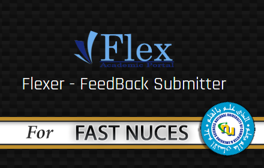
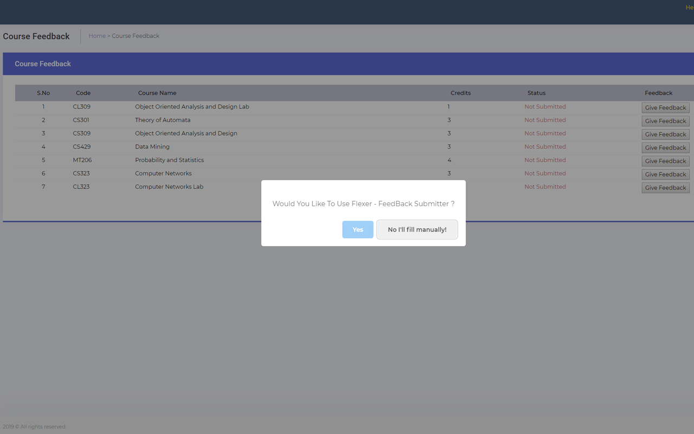
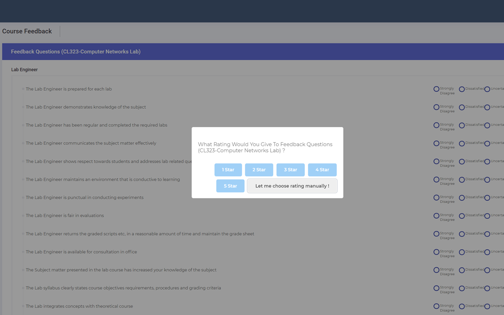

<h1 align="center">Flexer

  

Feedback Submission Bot

One-Click Submission of FLEX Feedback for FAST-NUCES ( National University of Computer and Emerging Sciences ) 

### Usage
1) [Download Extension From Chrome Webstore]()
2) [Open Course Feedback Page](http://flexstudent.nu.edu.pk/Student/CourseFeedback)
3) Follow the prompts

### Screenshots
  
 

### To-Do
- [X] Turn it into Chrome Extension. 
- [X] Add options for All Ratings. 
- [ ] Add Single-click option for submitting all feedbacks from any URL of Flex.
