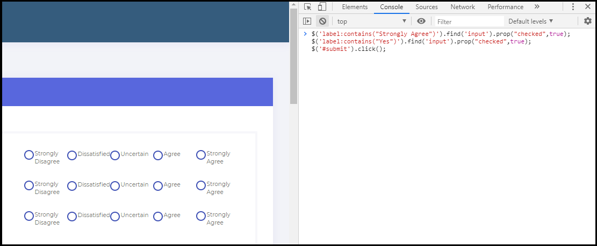

# Flexer
One-Click Submission of FLEX Feedback for FAST-NUCES ( National University of Computer and Emerging Sciences )

### Usage
1) Open [Flex Feedback Page](http://flexstudent.nu.edu.pk/Student/CourseFeedback) where Radio buttons are located.
2) Open Developer's Console (Ctrl+Shift+I), paste following code and press [Enter]:
```javascript
$('label:contains("Strongly Agree")').find('input').prop("checked",true);
$('label:contains("Yes")').find('input').prop("checked",true);
$('#submit').click();
```



### To-Do
- [] Turn it into Chrome Extension. 
- [] Add options for All Ratings. 
- [] Add Single-click option for submitting all feedbacks from any URL of Flex.
